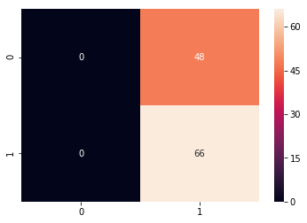
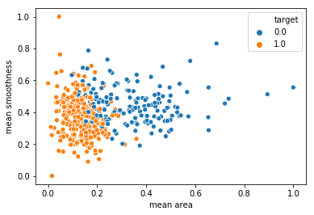
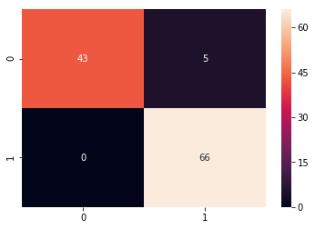
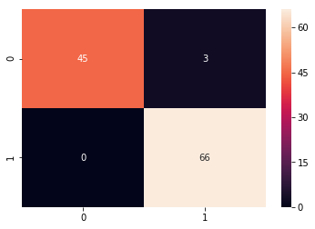

```python
import pandas as pd
import numpy as np 
import matplotlib.pyplot as plt
import seaborn as sns
```


```python
from sklearn.datasets import load_breast_cancer
```


```python
cancer = load_breast_cancer()
```


```python
cancer
```


    {'data': array([[1.799e+01, 1.038e+01, 1.228e+02, ..., 2.654e-01, 4.601e-01,
             1.189e-01],
            [2.057e+01, 1.777e+01, 1.329e+02, ..., 1.860e-01, 2.750e-01,
             8.902e-02],
            [1.969e+01, 2.125e+01, 1.300e+02, ..., 2.430e-01, 3.613e-01,
             8.758e-02],
            ...,
            [1.660e+01, 2.808e+01, 1.083e+02, ..., 1.418e-01, 2.218e-01,
             7.820e-02],
            [2.060e+01, 2.933e+01, 1.401e+02, ..., 2.650e-01, 4.087e-01,
             1.240e-01],
            [7.760e+00, 2.454e+01, 4.792e+01, ..., 0.000e+00, 2.871e-01,
             7.039e-02]]),
     'target': array([0, 0, 0, 0, 0, 0, 0, 0, 0, 0, 0, 0, 0, 0, 0, 0, 0, 0, 0, 1, 1, 1,
            0, 0, 0, 0, 0, 0, 0, 0, 0, 0, 0, 0, 0, 0, 0, 1, 0, 0, 0, 0, 0, 0,
            0, 0, 1, 0, 1, 1, 1, 1, 1, 0, 0, 1, 0, 0, 1, 1, 1, 1, 0, 1, 0, 0,
            1, 1, 1, 1, 0, 1, 0, 0, 1, 0, 1, 0, 0, 1, 1, 1, 0, 0, 1, 0, 0, 0,
            1, 1, 1, 0, 1, 1, 0, 0, 1, 1, 1, 0, 0, 1, 1, 1, 1, 0, 1, 1, 0, 1,
            1, 1, 1, 1, 1, 1, 1, 0, 0, 0, 1, 0, 0, 1, 1, 1, 0, 0, 1, 0, 1, 0,
            0, 1, 0, 0, 1, 1, 0, 1, 1, 0, 1, 1, 1, 1, 0, 1, 1, 1, 1, 1, 1, 1,
            1, 1, 0, 1, 1, 1, 1, 0, 0, 1, 0, 1, 1, 0, 0, 1, 1, 0, 0, 1, 1, 1,
            1, 0, 1, 1, 0, 0, 0, 1, 0, 1, 0, 1, 1, 1, 0, 1, 1, 0, 0, 1, 0, 0,
            0, 0, 1, 0, 0, 0, 1, 0, 1, 0, 1, 1, 0, 1, 0, 0, 0, 0, 1, 1, 0, 0,
            1, 1, 1, 0, 1, 1, 1, 1, 1, 0, 0, 1, 1, 0, 1, 1, 0, 0, 1, 0, 1, 1,
            1, 1, 0, 1, 1, 1, 1, 1, 0, 1, 0, 0, 0, 0, 0, 0, 0, 0, 0, 0, 0, 0,
            0, 0, 1, 1, 1, 1, 1, 1, 0, 1, 0, 1, 1, 0, 1, 1, 0, 1, 0, 0, 1, 1,
            1, 1, 1, 1, 1, 1, 1, 1, 1, 1, 1, 0, 1, 1, 0, 1, 0, 1, 1, 1, 1, 1,
            1, 1, 1, 1, 1, 1, 1, 1, 1, 0, 1, 1, 1, 0, 1, 0, 1, 1, 1, 1, 0, 0,
            0, 1, 1, 1, 1, 0, 1, 0, 1, 0, 1, 1, 1, 0, 1, 1, 1, 1, 1, 1, 1, 0,
            0, 0, 1, 1, 1, 1, 1, 1, 1, 1, 1, 1, 1, 0, 0, 1, 0, 0, 0, 1, 0, 0,
            1, 1, 1, 1, 1, 0, 1, 1, 1, 1, 1, 0, 1, 1, 1, 0, 1, 1, 0, 0, 1, 1,
            1, 1, 1, 1, 0, 1, 1, 1, 1, 1, 1, 1, 0, 1, 1, 1, 1, 1, 0, 1, 1, 0,
            1, 1, 1, 1, 1, 1, 1, 1, 1, 1, 1, 1, 0, 1, 0, 0, 1, 0, 1, 1, 1, 1,
            1, 0, 1, 1, 0, 1, 0, 1, 1, 0, 1, 0, 1, 1, 1, 1, 1, 1, 1, 1, 0, 0,
            1, 1, 1, 1, 1, 1, 0, 1, 1, 1, 1, 1, 1, 1, 1, 1, 1, 0, 1, 1, 1, 1,
            1, 1, 1, 0, 1, 0, 1, 1, 0, 1, 1, 1, 1, 1, 0, 0, 1, 0, 1, 0, 1, 1,
            1, 1, 1, 0, 1, 1, 0, 1, 0, 1, 0, 0, 1, 1, 1, 0, 1, 1, 1, 1, 1, 1,
            1, 1, 1, 1, 1, 0, 1, 0, 0, 1, 1, 1, 1, 1, 1, 1, 1, 1, 1, 1, 1, 1,
            1, 1, 1, 1, 1, 1, 1, 1, 1, 1, 1, 1, 0, 0, 0, 0, 0, 0, 1]),
     'target_names': array(['malignant', 'benign'], dtype='<U9'),
     'DESCR': 'Breast Cancer Wisconsin (Diagnostic) Database\n=============================================\n\nNotes\n-----\nData Set Characteristics:\n    :Number of Instances: 569\n\n    :Number of Attributes: 30 numeric, predictive attributes and the class\n\n    :Attribute Information:\n        - radius (mean of distances from center to points on the perimeter)\n        - texture (standard deviation of gray-scale values)\n        - perimeter\n        - area\n        - smoothness (local variation in radius lengths)\n        - compactness (perimeter^2 / area - 1.0)\n        - concavity (severity of concave portions of the contour)\n        - concave points (number of concave portions of the contour)\n        - symmetry \n        - fractal dimension ("coastline approximation" - 1)\n\n        The mean, standard error, and "worst" or largest (mean of the three\n        largest values) of these features were computed for each image,\n        resulting in 30 features.  For instance, field 3 is Mean Radius, field\n        13 is Radius SE, field 23 is Worst Radius.\n\n        - class:\n                - WDBC-Malignant\n                - WDBC-Benign\n\n    :Summary Statistics:\n\n    ===================================== ====== ======\n                                           Min    Max\n    ===================================== ====== ======\n    radius (mean):                        6.981  28.11\n    texture (mean):                       9.71   39.28\n    perimeter (mean):                     43.79  188.5\n    area (mean):                          143.5  2501.0\n    smoothness (mean):                    0.053  0.163\n    compactness (mean):                   0.019  0.345\n    concavity (mean):                     0.0    0.427\n    concave points (mean):                0.0    0.201\n    symmetry (mean):                      0.106  0.304\n    fractal dimension (mean):             0.05   0.097\n    radius (standard error):              0.112  2.873\n    texture (standard error):             0.36   4.885\n    perimeter (standard error):           0.757  21.98\n    area (standard error):                6.802  542.2\n    smoothness (standard error):          0.002  0.031\n    compactness (standard error):         0.002  0.135\n    concavity (standard error):           0.0    0.396\n    concave points (standard error):      0.0    0.053\n    symmetry (standard error):            0.008  0.079\n    fractal dimension (standard error):   0.001  0.03\n    radius (worst):                       7.93   36.04\n    texture (worst):                      12.02  49.54\n    perimeter (worst):                    50.41  251.2\n    area (worst):                         185.2  4254.0\n    smoothness (worst):                   0.071  0.223\n    compactness (worst):                  0.027  1.058\n    concavity (worst):                    0.0    1.252\n    concave points (worst):               0.0    0.291\n    symmetry (worst):                     0.156  0.664\n    fractal dimension (worst):            0.055  0.208\n    ===================================== ====== ======\n\n    :Missing Attribute Values: None\n\n    :Class Distribution: 212 - Malignant, 357 - Benign\n\n    :Creator:  Dr. William H. Wolberg, W. Nick Street, Olvi L. Mangasarian\n\n    :Donor: Nick Street\n\n    :Date: November, 1995\n\nThis is a copy of UCI ML Breast Cancer Wisconsin (Diagnostic) datasets.\nhttps://goo.gl/U2Uwz2\n\nFeatures are computed from a digitized image of a fine needle\naspirate (FNA) of a breast mass.  They describe\ncharacteristics of the cell nuclei present in the image.\n\nSeparating plane described above was obtained using\nMultisurface Method-Tree (MSM-T) [K. P. Bennett, "Decision Tree\nConstruction Via Linear Programming." Proceedings of the 4th\nMidwest Artificial Intelligence and Cognitive Science Society,\npp. 97-101, 1992], a classification method which uses linear\nprogramming to construct a decision tree.  Relevant features\nwere selected using an exhaustive search in the space of 1-4\nfeatures and 1-3 separating planes.\n\nThe actual linear program used to obtain the separating plane\nin the 3-dimensional space is that described in:\n[K. P. Bennett and O. L. Mangasarian: "Robust Linear\nProgramming Discrimination of Two Linearly Inseparable Sets",\nOptimization Methods and Software 1, 1992, 23-34].\n\nThis database is also available through the UW CS ftp server:\n\nftp ftp.cs.wisc.edu\ncd math-prog/cpo-dataset/machine-learn/WDBC/\n\nReferences\n----------\n   - W.N. Street, W.H. Wolberg and O.L. Mangasarian. Nuclear feature extraction \n     for breast tumor diagnosis. IS&T/SPIE 1993 International Symposium on \n     Electronic Imaging: Science and Technology, volume 1905, pages 861-870,\n     San Jose, CA, 1993.\n   - O.L. Mangasarian, W.N. Street and W.H. Wolberg. Breast cancer diagnosis and \n     prognosis via linear programming. Operations Research, 43(4), pages 570-577, \n     July-August 1995.\n   - W.H. Wolberg, W.N. Street, and O.L. Mangasarian. Machine learning techniques\n     to diagnose breast cancer from fine-needle aspirates. Cancer Letters 77 (1994) \n     163-171.\n',
     'feature_names': array(['mean radius', 'mean texture', 'mean perimeter', 'mean area',
            'mean smoothness', 'mean compactness', 'mean concavity',
            'mean concave points', 'mean symmetry', 'mean fractal dimension',
            'radius error', 'texture error', 'perimeter error', 'area error',
            'smoothness error', 'compactness error', 'concavity error',
            'concave points error', 'symmetry error',
            'fractal dimension error', 'worst radius', 'worst texture',
            'worst perimeter', 'worst area', 'worst smoothness',
            'worst compactness', 'worst concavity', 'worst concave points',
            'worst symmetry', 'worst fractal dimension'], dtype='<U23')}


```python
df_cancer = pd.DataFrame(np.c_[cancer['data'],cancer['target']],columns = np.append(cancer['feature_names'],['target']))
```


```python
df_cancer.head()
```


<div>
<style scoped>
    .dataframe tbody tr th:only-of-type {
        vertical-align: middle;
    }

    .dataframe tbody tr th {
        vertical-align: top;
    }

    .dataframe thead th {
        text-align: right;
    }
</style>
<table border="1" class="dataframe">
  <thead>
    <tr style="text-align: right;">
      <th></th>
      <th>mean radius</th>
      <th>mean texture</th>
      <th>mean perimeter</th>
      <th>mean area</th>
      <th>mean smoothness</th>
      <th>mean compactness</th>
      <th>mean concavity</th>
      <th>mean concave points</th>
      <th>mean symmetry</th>
      <th>mean fractal dimension</th>
      <th>...</th>
      <th>worst texture</th>
      <th>worst perimeter</th>
      <th>worst area</th>
      <th>worst smoothness</th>
      <th>worst compactness</th>
      <th>worst concavity</th>
      <th>worst concave points</th>
      <th>worst symmetry</th>
      <th>worst fractal dimension</th>
      <th>target</th>
    </tr>
  </thead>
  <tbody>
    <tr>
      <th>0</th>
      <td>17.99</td>
      <td>10.38</td>
      <td>122.80</td>
      <td>1001.0</td>
      <td>0.11840</td>
      <td>0.27760</td>
      <td>0.3001</td>
      <td>0.14710</td>
      <td>0.2419</td>
      <td>0.07871</td>
      <td>...</td>
      <td>17.33</td>
      <td>184.60</td>
      <td>2019.0</td>
      <td>0.1622</td>
      <td>0.6656</td>
      <td>0.7119</td>
      <td>0.2654</td>
      <td>0.4601</td>
      <td>0.11890</td>
      <td>0.0</td>
    </tr>
    <tr>
      <th>1</th>
      <td>20.57</td>
      <td>17.77</td>
      <td>132.90</td>
      <td>1326.0</td>
      <td>0.08474</td>
      <td>0.07864</td>
      <td>0.0869</td>
      <td>0.07017</td>
      <td>0.1812</td>
      <td>0.05667</td>
      <td>...</td>
      <td>23.41</td>
      <td>158.80</td>
      <td>1956.0</td>
      <td>0.1238</td>
      <td>0.1866</td>
      <td>0.2416</td>
      <td>0.1860</td>
      <td>0.2750</td>
      <td>0.08902</td>
      <td>0.0</td>
    </tr>
    <tr>
      <th>2</th>
      <td>19.69</td>
      <td>21.25</td>
      <td>130.00</td>
      <td>1203.0</td>
      <td>0.10960</td>
      <td>0.15990</td>
      <td>0.1974</td>
      <td>0.12790</td>
      <td>0.2069</td>
      <td>0.05999</td>
      <td>...</td>
      <td>25.53</td>
      <td>152.50</td>
      <td>1709.0</td>
      <td>0.1444</td>
      <td>0.4245</td>
      <td>0.4504</td>
      <td>0.2430</td>
      <td>0.3613</td>
      <td>0.08758</td>
      <td>0.0</td>
    </tr>
    <tr>
      <th>3</th>
      <td>11.42</td>
      <td>20.38</td>
      <td>77.58</td>
      <td>386.1</td>
      <td>0.14250</td>
      <td>0.28390</td>
      <td>0.2414</td>
      <td>0.10520</td>
      <td>0.2597</td>
      <td>0.09744</td>
      <td>...</td>
      <td>26.50</td>
      <td>98.87</td>
      <td>567.7</td>
      <td>0.2098</td>
      <td>0.8663</td>
      <td>0.6869</td>
      <td>0.2575</td>
      <td>0.6638</td>
      <td>0.17300</td>
      <td>0.0</td>
    </tr>
    <tr>
      <th>4</th>
      <td>20.29</td>
      <td>14.34</td>
      <td>135.10</td>
      <td>1297.0</td>
      <td>0.10030</td>
      <td>0.13280</td>
      <td>0.1980</td>
      <td>0.10430</td>
      <td>0.1809</td>
      <td>0.05883</td>
      <td>...</td>
      <td>16.67</td>
      <td>152.20</td>
      <td>1575.0</td>
      <td>0.1374</td>
      <td>0.2050</td>
      <td>0.4000</td>
      <td>0.1625</td>
      <td>0.2364</td>
      <td>0.07678</td>
      <td>0.0</td>
    </tr>
  </tbody>
</table>
<p>5 rows × 31 columns</p>
</div>


```python
X = df_cancer.drop(['target'], axis = 1)
```


```python
X.keys()
```


    Index(['mean radius', 'mean texture', 'mean perimeter', 'mean area',
           'mean smoothness', 'mean compactness', 'mean concavity',
           'mean concave points', 'mean symmetry', 'mean fractal dimension',
           'radius error', 'texture error', 'perimeter error', 'area error',
           'smoothness error', 'compactness error', 'concavity error',
           'concave points error', 'symmetry error', 'fractal dimension error',
           'worst radius', 'worst texture', 'worst perimeter', 'worst area',
           'worst smoothness', 'worst compactness', 'worst concavity',
           'worst concave points', 'worst symmetry', 'worst fractal dimension'],
          dtype='object')


```python
X.head()
```


<div>
<style scoped>
    .dataframe tbody tr th:only-of-type {
        vertical-align: middle;
    }

    .dataframe tbody tr th {
        vertical-align: top;
    }

    .dataframe thead th {
        text-align: right;
    }
</style>
<table border="1" class="dataframe">
  <thead>
    <tr style="text-align: right;">
      <th></th>
      <th>mean radius</th>
      <th>mean texture</th>
      <th>mean perimeter</th>
      <th>mean area</th>
      <th>mean smoothness</th>
      <th>mean compactness</th>
      <th>mean concavity</th>
      <th>mean concave points</th>
      <th>mean symmetry</th>
      <th>mean fractal dimension</th>
      <th>...</th>
      <th>worst radius</th>
      <th>worst texture</th>
      <th>worst perimeter</th>
      <th>worst area</th>
      <th>worst smoothness</th>
      <th>worst compactness</th>
      <th>worst concavity</th>
      <th>worst concave points</th>
      <th>worst symmetry</th>
      <th>worst fractal dimension</th>
    </tr>
  </thead>
  <tbody>
    <tr>
      <th>0</th>
      <td>17.99</td>
      <td>10.38</td>
      <td>122.80</td>
      <td>1001.0</td>
      <td>0.11840</td>
      <td>0.27760</td>
      <td>0.3001</td>
      <td>0.14710</td>
      <td>0.2419</td>
      <td>0.07871</td>
      <td>...</td>
      <td>25.38</td>
      <td>17.33</td>
      <td>184.60</td>
      <td>2019.0</td>
      <td>0.1622</td>
      <td>0.6656</td>
      <td>0.7119</td>
      <td>0.2654</td>
      <td>0.4601</td>
      <td>0.11890</td>
    </tr>
    <tr>
      <th>1</th>
      <td>20.57</td>
      <td>17.77</td>
      <td>132.90</td>
      <td>1326.0</td>
      <td>0.08474</td>
      <td>0.07864</td>
      <td>0.0869</td>
      <td>0.07017</td>
      <td>0.1812</td>
      <td>0.05667</td>
      <td>...</td>
      <td>24.99</td>
      <td>23.41</td>
      <td>158.80</td>
      <td>1956.0</td>
      <td>0.1238</td>
      <td>0.1866</td>
      <td>0.2416</td>
      <td>0.1860</td>
      <td>0.2750</td>
      <td>0.08902</td>
    </tr>
    <tr>
      <th>2</th>
      <td>19.69</td>
      <td>21.25</td>
      <td>130.00</td>
      <td>1203.0</td>
      <td>0.10960</td>
      <td>0.15990</td>
      <td>0.1974</td>
      <td>0.12790</td>
      <td>0.2069</td>
      <td>0.05999</td>
      <td>...</td>
      <td>23.57</td>
      <td>25.53</td>
      <td>152.50</td>
      <td>1709.0</td>
      <td>0.1444</td>
      <td>0.4245</td>
      <td>0.4504</td>
      <td>0.2430</td>
      <td>0.3613</td>
      <td>0.08758</td>
    </tr>
    <tr>
      <th>3</th>
      <td>11.42</td>
      <td>20.38</td>
      <td>77.58</td>
      <td>386.1</td>
      <td>0.14250</td>
      <td>0.28390</td>
      <td>0.2414</td>
      <td>0.10520</td>
      <td>0.2597</td>
      <td>0.09744</td>
      <td>...</td>
      <td>14.91</td>
      <td>26.50</td>
      <td>98.87</td>
      <td>567.7</td>
      <td>0.2098</td>
      <td>0.8663</td>
      <td>0.6869</td>
      <td>0.2575</td>
      <td>0.6638</td>
      <td>0.17300</td>
    </tr>
    <tr>
      <th>4</th>
      <td>20.29</td>
      <td>14.34</td>
      <td>135.10</td>
      <td>1297.0</td>
      <td>0.10030</td>
      <td>0.13280</td>
      <td>0.1980</td>
      <td>0.10430</td>
      <td>0.1809</td>
      <td>0.05883</td>
      <td>...</td>
      <td>22.54</td>
      <td>16.67</td>
      <td>152.20</td>
      <td>1575.0</td>
      <td>0.1374</td>
      <td>0.2050</td>
      <td>0.4000</td>
      <td>0.1625</td>
      <td>0.2364</td>
      <td>0.07678</td>
    </tr>
  </tbody>
</table>
<p>5 rows × 30 columns</p>
</div>


```python
y = df_cancer['target']
```


```python
y.shape
```


    (569,)


```python
from sklearn.model_selection import train_test_split
```


```python
X_train, X_test, y_train, y_test = train_test_split(X, y, test_size=0.2, random_state=5)
```


```python
X_train.shape
```


    (455, 30)


```python
X_test.shape
```


    (114, 30)


```python
from sklearn.svm import SVC
```


```python
from sklearn.metrics import confusion_matrix, classification_report
```


```python
svc_model = SVC()
```


```python
svc_model.fit(X_train, y_train)
```


    SVC(C=1.0, cache_size=200, class_weight=None, coef0=0.0,
      decision_function_shape='ovr', degree=3, gamma='auto', kernel='rbf',
      max_iter=-1, probability=False, random_state=None, shrinking=True,
      tol=0.001, verbose=False)


```python
y_pred = svc_model.predict(X_test)
```


```python
cm = confusion_matrix(y_test, y_pred)
```


```python
cm
```


    array([[ 0, 48],
           [ 0, 66]], dtype=int64)


```python
sns.heatmap(cm , annot = True)
```


    <matplotlib.axes._subplots.AxesSubplot at 0x180aec29160>





```python
min_range = X_train.min()
```


```python
range_ = (X_train-min_range).max()
```


```python
X_train_scal = (X_train-min_range)/range_
```


```python
sns.scatterplot(x = X_train_scal['mean area'], y = X_train_scal['mean smoothness'], hue = y_train)
```


    <matplotlib.axes._subplots.AxesSubplot at 0x180aea8f128>





```python
min_test = X_test.min()
mn_range = (X_test-min_test).max()
X_test_scal = (X_test-min_test)/mn_range
```


```python
svc_model.fit(X_train_scal,y_train)
```


    SVC(C=1.0, cache_size=200, class_weight=None, coef0=0.0,
      decision_function_shape='ovr', degree=3, gamma='auto', kernel='rbf',
      max_iter=-1, probability=False, random_state=None, shrinking=True,
      tol=0.001, verbose=False)


```python
y_pred2 = svc_model.predict(X_test_scal)
```


```python
cm =  confusion_matrix(y_test, y_pred2)
```


```python
cm
```


    array([[43,  5],
           [ 0, 66]], dtype=int64)


```python
sns.heatmap(cm, annot= True)
```


    <matplotlib.axes._subplots.AxesSubplot at 0x180aee4b320>





```python
print (classification_report(y_test, y_pred2))
```

                 precision    recall  f1-score   support
    
            0.0       1.00      0.90      0.95        48
            1.0       0.93      1.00      0.96        66
    
    avg / total       0.96      0.96      0.96       114
    
    


```python
param_grid = {'C': [0.1, 1, 10, 100], 'gamma': [1, 0.1, 0.01, 0.001], 'kernel': ['rbf']} 
```


```python
from sklearn.model_selection import GridSearchCV
```


```python
grid = GridSearchCV(SVC(),param_grid,refit=True,verbose=4)
```


```python
grid.fit(X_train_scal, y_train)
```

    Fitting 3 folds for each of 16 candidates, totalling 48 fits
    [CV] C=0.1, gamma=1, kernel=rbf ......................................
    [CV]  C=0.1, gamma=1, kernel=rbf, score=0.9671052631578947, total=   0.0s
    [CV] C=0.1, gamma=1, kernel=rbf ......................................
    [CV]  C=0.1, gamma=1, kernel=rbf, score=0.9210526315789473, total=   0.0s
    [CV] C=0.1, gamma=1, kernel=rbf ......................................
    [CV]  C=0.1, gamma=1, kernel=rbf, score=0.9470198675496688, total=   0.0s
    [CV] C=0.1, gamma=0.1, kernel=rbf ....................................
    [CV]  C=0.1, gamma=0.1, kernel=rbf, score=0.9144736842105263, total=   0.0s
    [CV] C=0.1, gamma=0.1, kernel=rbf ....................................
    [CV]  C=0.1, gamma=0.1, kernel=rbf, score=0.8881578947368421, total=   0.0s
    [CV] C=0.1, gamma=0.1, kernel=rbf ....................................
    [CV]  C=0.1, gamma=0.1, kernel=rbf, score=0.8675496688741722, total=   0.0s
    [CV] C=0.1, gamma=0.01, kernel=rbf ...................................
    [CV]  C=0.1, gamma=0.01, kernel=rbf, score=0.6381578947368421, total=   0.0s
    [CV] C=0.1, gamma=0.01, kernel=rbf ...................................
    [CV]  C=0.1, gamma=0.01, kernel=rbf, score=0.6381578947368421, total=   0.0s
    [CV] C=0.1, gamma=0.01, kernel=rbf ...................................
    

    [Parallel(n_jobs=1)]: Done   1 out of   1 | elapsed:    0.0s remaining:    0.0s
    [Parallel(n_jobs=1)]: Done   2 out of   2 | elapsed:    0.0s remaining:    0.0s
    [Parallel(n_jobs=1)]: Done   3 out of   3 | elapsed:    0.0s remaining:    0.0s
    

    [CV]  C=0.1, gamma=0.01, kernel=rbf, score=0.6423841059602649, total=   0.0s
    [CV] C=0.1, gamma=0.001, kernel=rbf ..................................
    [CV]  C=0.1, gamma=0.001, kernel=rbf, score=0.6381578947368421, total=   0.0s
    [CV] C=0.1, gamma=0.001, kernel=rbf ..................................
    [CV]  C=0.1, gamma=0.001, kernel=rbf, score=0.6381578947368421, total=   0.0s
    [CV] C=0.1, gamma=0.001, kernel=rbf ..................................
    [CV]  C=0.1, gamma=0.001, kernel=rbf, score=0.6423841059602649, total=   0.0s
    [CV] C=1, gamma=1, kernel=rbf ........................................
    [CV]  C=1, gamma=1, kernel=rbf, score=0.993421052631579, total=   0.0s
    [CV] C=1, gamma=1, kernel=rbf ........................................
    [CV]  C=1, gamma=1, kernel=rbf, score=0.9473684210526315, total=   0.0s
    [CV] C=1, gamma=1, kernel=rbf ........................................
    [CV]  C=1, gamma=1, kernel=rbf, score=0.9801324503311258, total=   0.0s
    [CV] C=1, gamma=0.1, kernel=rbf ......................................
    [CV]  C=1, gamma=0.1, kernel=rbf, score=0.9736842105263158, total=   0.0s
    [CV] C=1, gamma=0.1, kernel=rbf ......................................
    [CV]  C=1, gamma=0.1, kernel=rbf, score=0.9276315789473685, total=   0.0s
    [CV] C=1, gamma=0.1, kernel=rbf ......................................
    [CV]  C=1, gamma=0.1, kernel=rbf, score=0.9403973509933775, total=   0.0s
    [CV] C=1, gamma=0.01, kernel=rbf .....................................
    [CV]  C=1, gamma=0.01, kernel=rbf, score=0.9144736842105263, total=   0.0s
    [CV] C=1, gamma=0.01, kernel=rbf .....................................
    [CV]  C=1, gamma=0.01, kernel=rbf, score=0.8947368421052632, total=   0.0s
    [CV] C=1, gamma=0.01, kernel=rbf .....................................
    [CV]  C=1, gamma=0.01, kernel=rbf, score=0.8675496688741722, total=   0.0s
    [CV] C=1, gamma=0.001, kernel=rbf ....................................
    [CV]  C=1, gamma=0.001, kernel=rbf, score=0.6381578947368421, total=   0.0s
    [CV] C=1, gamma=0.001, kernel=rbf ....................................
    [CV]  C=1, gamma=0.001, kernel=rbf, score=0.6381578947368421, total=   0.0s
    [CV] C=1, gamma=0.001, kernel=rbf ....................................
    [CV]  C=1, gamma=0.001, kernel=rbf, score=0.6423841059602649, total=   0.0s
    [CV] C=10, gamma=1, kernel=rbf .......................................
    [CV]  C=10, gamma=1, kernel=rbf, score=0.993421052631579, total=   0.0s
    [CV] C=10, gamma=1, kernel=rbf .......................................
    [CV]  C=10, gamma=1, kernel=rbf, score=0.9605263157894737, total=   0.0s
    [CV] C=10, gamma=1, kernel=rbf .......................................
    [CV]  C=10, gamma=1, kernel=rbf, score=0.9735099337748344, total=   0.0s
    [CV] C=10, gamma=0.1, kernel=rbf .....................................
    [CV]  C=10, gamma=0.1, kernel=rbf, score=0.993421052631579, total=   0.0s
    [CV] C=10, gamma=0.1, kernel=rbf .....................................
    [CV]  C=10, gamma=0.1, kernel=rbf, score=0.9671052631578947, total=   0.0s
    [CV] C=10, gamma=0.1, kernel=rbf .....................................
    [CV]  C=10, gamma=0.1, kernel=rbf, score=0.9735099337748344, total=   0.0s
    [CV] C=10, gamma=0.01, kernel=rbf ....................................
    [CV]  C=10, gamma=0.01, kernel=rbf, score=0.9736842105263158, total=   0.0s
    [CV] C=10, gamma=0.01, kernel=rbf ....................................
    [CV]  C=10, gamma=0.01, kernel=rbf, score=0.9210526315789473, total=   0.0s
    [CV] C=10, gamma=0.01, kernel=rbf ....................................
    [CV]  C=10, gamma=0.01, kernel=rbf, score=0.9403973509933775, total=   0.0s
    [CV] C=10, gamma=0.001, kernel=rbf ...................................
    [CV]  C=10, gamma=0.001, kernel=rbf, score=0.9144736842105263, total=   0.0s
    [CV] C=10, gamma=0.001, kernel=rbf ...................................
    [CV]  C=10, gamma=0.001, kernel=rbf, score=0.8947368421052632, total=   0.0s
    [CV] C=10, gamma=0.001, kernel=rbf ...................................
    [CV]  C=10, gamma=0.001, kernel=rbf, score=0.8675496688741722, total=   0.0s
    [CV] C=100, gamma=1, kernel=rbf ......................................
    [CV]  C=100, gamma=1, kernel=rbf, score=0.9605263157894737, total=   0.0s
    [CV] C=100, gamma=1, kernel=rbf ......................................
    [CV]  C=100, gamma=1, kernel=rbf, score=0.9539473684210527, total=   0.0s
    [CV] C=100, gamma=1, kernel=rbf ......................................
    [CV]  C=100, gamma=1, kernel=rbf, score=0.9801324503311258, total=   0.0s
    [CV] C=100, gamma=0.1, kernel=rbf ....................................
    [CV]  C=100, gamma=0.1, kernel=rbf, score=0.9868421052631579, total=   0.0s
    [CV] C=100, gamma=0.1, kernel=rbf ....................................
    [CV]  C=100, gamma=0.1, kernel=rbf, score=0.9539473684210527, total=   0.0s
    [CV] C=100, gamma=0.1, kernel=rbf ....................................
    [CV]  C=100, gamma=0.1, kernel=rbf, score=0.9801324503311258, total=   0.0s
    [CV] C=100, gamma=0.01, kernel=rbf ...................................
    [CV]  C=100, gamma=0.01, kernel=rbf, score=0.993421052631579, total=   0.0s
    [CV] C=100, gamma=0.01, kernel=rbf ...................................
    [CV]  C=100, gamma=0.01, kernel=rbf, score=0.9671052631578947, total=   0.0s
    [CV] C=100, gamma=0.01, kernel=rbf ...................................
    [CV]  C=100, gamma=0.01, kernel=rbf, score=0.9735099337748344, total=   0.0s
    [CV] C=100, gamma=0.001, kernel=rbf ..................................
    [CV]  C=100, gamma=0.001, kernel=rbf, score=0.9736842105263158, total=   0.0s
    [CV] C=100, gamma=0.001, kernel=rbf ..................................
    [CV]  C=100, gamma=0.001, kernel=rbf, score=0.9210526315789473, total=   0.0s
    [CV] C=100, gamma=0.001, kernel=rbf ..................................
    [CV]  C=100, gamma=0.001, kernel=rbf, score=0.9403973509933775, total=   0.0s
    

    [Parallel(n_jobs=1)]: Done  48 out of  48 | elapsed:    0.8s finished
    


    GridSearchCV(cv=None, error_score='raise',
           estimator=SVC(C=1.0, cache_size=200, class_weight=None, coef0=0.0,
      decision_function_shape='ovr', degree=3, gamma='auto', kernel='rbf',
      max_iter=-1, probability=False, random_state=None, shrinking=True,
      tol=0.001, verbose=False),
           fit_params=None, iid=True, n_jobs=1,
           param_grid={'C': [0.1, 1, 10, 100], 'gamma': [1, 0.1, 0.01, 0.001], 'kernel': ['rbf']},
           pre_dispatch='2*n_jobs', refit=True, return_train_score='warn',
           scoring=None, verbose=4)


```python
grid.best_params_
```


    {'C': 10, 'gamma': 0.1, 'kernel': 'rbf'}


```python
param_grid = {'C': [10, 20, 30, 40, 50, 60, 70, 80, 90, 100], 'gamma': [0.1, 0.2, 0.3, 0.4, 0.5, 0.6, 0.7, 0.8, 0.9, 1], 'kernel': ['rbf']} 
```


```python
grid = GridSearchCV(SVC(), param_grid, refit = True, verbose = 4)
```


```python
grid.fit(X_train_scal, y_train)
```

    Fitting 3 folds for each of 100 candidates, totalling 300 fits
    [CV] C=10, gamma=0.1, kernel=rbf .....................................
    [CV]  C=10, gamma=0.1, kernel=rbf, score=0.993421052631579, total=   0.0s
    [CV] C=10, gamma=0.1, kernel=rbf .....................................
    [CV]  C=10, gamma=0.1, kernel=rbf, score=0.9671052631578947, total=   0.0s
    [CV] C=10, gamma=0.1, kernel=rbf .....................................
    [CV]  C=10, gamma=0.1, kernel=rbf, score=0.9735099337748344, total=   0.0s
    [CV] C=10, gamma=0.2, kernel=rbf .....................................
    [CV]  C=10, gamma=0.2, kernel=rbf, score=0.993421052631579, total=   0.0s
    [CV] C=10, gamma=0.2, kernel=rbf .....................................
    [CV]  C=10, gamma=0.2, kernel=rbf, score=0.9736842105263158, total=   0.0s
    [CV] C=10, gamma=0.2, kernel=rbf .....................................
    [CV]  C=10, gamma=0.2, kernel=rbf, score=0.9668874172185431, total=   0.0s
    [CV] C=10, gamma=0.3, kernel=rbf .....................................
    [CV]  C=10, gamma=0.3, kernel=rbf, score=0.993421052631579, total=   0.0s
    [CV] C=10, gamma=0.3, kernel=rbf .....................................
    [CV]  C=10, gamma=0.3, kernel=rbf, score=0.9671052631578947, total=   0.0s
    [CV] C=10, gamma=0.3, kernel=rbf .....................................
    [CV]  C=10, gamma=0.3, kernel=rbf, score=0.9867549668874173, total=   0.0s
    [CV] C=10, gamma=0.4, kernel=rbf .....................................
    [CV]  C=10, gamma=0.4, kernel=rbf, score=0.993421052631579, total=   0.0s
    [CV] C=10, gamma=0.4, kernel=rbf .....................................
    [CV]  C=10, gamma=0.4, kernel=rbf, score=0.9671052631578947, total=   0.0s
    [CV] C=10, gamma=0.4, kernel=rbf .....................................
    [CV]  C=10, gamma=0.4, kernel=rbf, score=0.9735099337748344, total=   0.0s
    [CV] C=10, gamma=0.5, kernel=rbf .....................................
    [CV]  C=10, gamma=0.5, kernel=rbf, score=0.993421052631579, total=   0.0s
    [CV] C=10, gamma=0.5, kernel=rbf .....................................
    [CV]  C=10, gamma=0.5, kernel=rbf, score=0.9605263157894737, total=   0.0s
    [CV] C=10, gamma=0.5, kernel=rbf .....................................
    [CV]  C=10, gamma=0.5, kernel=rbf, score=0.9801324503311258, total=   0.0s
    [CV] C=10, gamma=0.6, kernel=rbf .....................................
    [CV]  C=10, gamma=0.6, kernel=rbf, score=0.993421052631579, total=   0.0s
    [CV] C=10, gamma=0.6, kernel=rbf .....................................
    [CV]  C=10, gamma=0.6, kernel=rbf, score=0.9605263157894737, total=   0.0s
    [CV] C=10, gamma=0.6, kernel=rbf .....................................
    

    [Parallel(n_jobs=1)]: Done   1 out of   1 | elapsed:    0.0s remaining:    0.0s
    [Parallel(n_jobs=1)]: Done   2 out of   2 | elapsed:    0.0s remaining:    0.0s
    [Parallel(n_jobs=1)]: Done   3 out of   3 | elapsed:    0.0s remaining:    0.0s
    

    [CV]  C=10, gamma=0.6, kernel=rbf, score=0.9801324503311258, total=   0.0s
    [CV] C=10, gamma=0.7, kernel=rbf .....................................
    [CV]  C=10, gamma=0.7, kernel=rbf, score=0.993421052631579, total=   0.0s
    [CV] C=10, gamma=0.7, kernel=rbf .....................................
    [CV]  C=10, gamma=0.7, kernel=rbf, score=0.9605263157894737, total=   0.0s
    [CV] C=10, gamma=0.7, kernel=rbf .....................................
    [CV]  C=10, gamma=0.7, kernel=rbf, score=0.9801324503311258, total=   0.0s
    [CV] C=10, gamma=0.8, kernel=rbf .....................................
    [CV]  C=10, gamma=0.8, kernel=rbf, score=0.993421052631579, total=   0.0s
    [CV] C=10, gamma=0.8, kernel=rbf .....................................
    [CV]  C=10, gamma=0.8, kernel=rbf, score=0.9605263157894737, total=   0.0s
    [CV] C=10, gamma=0.8, kernel=rbf .....................................
    [CV]  C=10, gamma=0.8, kernel=rbf, score=0.9735099337748344, total=   0.0s
    [CV] C=10, gamma=0.9, kernel=rbf .....................................
    [CV]  C=10, gamma=0.9, kernel=rbf, score=0.993421052631579, total=   0.0s
    [CV] C=10, gamma=0.9, kernel=rbf .....................................
    [CV]  C=10, gamma=0.9, kernel=rbf, score=0.9605263157894737, total=   0.0s
    [CV] C=10, gamma=0.9, kernel=rbf .....................................
    [CV]  C=10, gamma=0.9, kernel=rbf, score=0.9735099337748344, total=   0.0s
    [CV] C=10, gamma=1, kernel=rbf .......................................
    [CV]  C=10, gamma=1, kernel=rbf, score=0.993421052631579, total=   0.0s
    [CV] C=10, gamma=1, kernel=rbf .......................................
    [CV]  C=10, gamma=1, kernel=rbf, score=0.9605263157894737, total=   0.0s
    [CV] C=10, gamma=1, kernel=rbf .......................................
    [CV]  C=10, gamma=1, kernel=rbf, score=0.9735099337748344, total=   0.0s
    [CV] C=20, gamma=0.1, kernel=rbf .....................................
    [CV]  C=20, gamma=0.1, kernel=rbf, score=0.993421052631579, total=   0.0s
    [CV] C=20, gamma=0.1, kernel=rbf .....................................
    [CV]  C=20, gamma=0.1, kernel=rbf, score=0.9671052631578947, total=   0.0s
    [CV] C=20, gamma=0.1, kernel=rbf .....................................
    [CV]  C=20, gamma=0.1, kernel=rbf, score=0.9668874172185431, total=   0.0s
    [CV] C=20, gamma=0.2, kernel=rbf .....................................
    [CV]  C=20, gamma=0.2, kernel=rbf, score=0.993421052631579, total=   0.0s
    [CV] C=20, gamma=0.2, kernel=rbf .....................................
    [CV]  C=20, gamma=0.2, kernel=rbf, score=0.9671052631578947, total=   0.0s
    [CV] C=20, gamma=0.2, kernel=rbf .....................................
    [CV]  C=20, gamma=0.2, kernel=rbf, score=0.9867549668874173, total=   0.0s
    [CV] C=20, gamma=0.3, kernel=rbf .....................................
    [CV]  C=20, gamma=0.3, kernel=rbf, score=0.993421052631579, total=   0.0s
    [CV] C=20, gamma=0.3, kernel=rbf .....................................
    [CV]  C=20, gamma=0.3, kernel=rbf, score=0.9671052631578947, total=   0.0s
    [CV] C=20, gamma=0.3, kernel=rbf .....................................
    [CV]  C=20, gamma=0.3, kernel=rbf, score=0.9735099337748344, total=   0.0s
    [CV] C=20, gamma=0.4, kernel=rbf .....................................
    [CV]  C=20, gamma=0.4, kernel=rbf, score=0.993421052631579, total=   0.0s
    [CV] C=20, gamma=0.4, kernel=rbf .....................................
    [CV]  C=20, gamma=0.4, kernel=rbf, score=0.9671052631578947, total=   0.0s
    [CV] C=20, gamma=0.4, kernel=rbf .....................................
    [CV]  C=20, gamma=0.4, kernel=rbf, score=0.9735099337748344, total=   0.0s
    [CV] C=20, gamma=0.5, kernel=rbf .....................................
    [CV]  C=20, gamma=0.5, kernel=rbf, score=0.993421052631579, total=   0.0s
    [CV] C=20, gamma=0.5, kernel=rbf .....................................
    [CV]  C=20, gamma=0.5, kernel=rbf, score=0.9605263157894737, total=   0.0s
    [CV] C=20, gamma=0.5, kernel=rbf .....................................
    [CV]  C=20, gamma=0.5, kernel=rbf, score=0.9668874172185431, total=   0.0s
    [CV] C=20, gamma=0.6, kernel=rbf .....................................
    [CV]  C=20, gamma=0.6, kernel=rbf, score=0.993421052631579, total=   0.0s
    [CV] C=20, gamma=0.6, kernel=rbf .....................................
    [CV]  C=20, gamma=0.6, kernel=rbf, score=0.9605263157894737, total=   0.0s
    [CV] C=20, gamma=0.6, kernel=rbf .....................................
    [CV]  C=20, gamma=0.6, kernel=rbf, score=0.9735099337748344, total=   0.0s
    [CV] C=20, gamma=0.7, kernel=rbf .....................................
    [CV]  C=20, gamma=0.7, kernel=rbf, score=0.9868421052631579, total=   0.0s
    [CV] C=20, gamma=0.7, kernel=rbf .....................................
    [CV]  C=20, gamma=0.7, kernel=rbf, score=0.9671052631578947, total=   0.0s
    [CV] C=20, gamma=0.7, kernel=rbf .....................................
    [CV]  C=20, gamma=0.7, kernel=rbf, score=0.9735099337748344, total=   0.0s
    [CV] C=20, gamma=0.8, kernel=rbf .....................................
    [CV]  C=20, gamma=0.8, kernel=rbf, score=0.9868421052631579, total=   0.0s
    [CV] C=20, gamma=0.8, kernel=rbf .....................................
    [CV]  C=20, gamma=0.8, kernel=rbf, score=0.9671052631578947, total=   0.0s
    [CV] C=20, gamma=0.8, kernel=rbf .....................................
    [CV]  C=20, gamma=0.8, kernel=rbf, score=0.9735099337748344, total=   0.0s
    [CV] C=20, gamma=0.9, kernel=rbf .....................................
    [CV]  C=20, gamma=0.9, kernel=rbf, score=0.9802631578947368, total=   0.0s
    [CV] C=20, gamma=0.9, kernel=rbf .....................................
    [CV]  C=20, gamma=0.9, kernel=rbf, score=0.9671052631578947, total=   0.0s
    [CV] C=20, gamma=0.9, kernel=rbf .....................................
    [CV]  C=20, gamma=0.9, kernel=rbf, score=0.9735099337748344, total=   0.0s
    [CV] C=20, gamma=1, kernel=rbf .......................................
    [CV]  C=20, gamma=1, kernel=rbf, score=0.9736842105263158, total=   0.0s
    [CV] C=20, gamma=1, kernel=rbf .......................................
    [CV]  C=20, gamma=1, kernel=rbf, score=0.9671052631578947, total=   0.0s
    [CV] C=20, gamma=1, kernel=rbf .......................................
    [CV]  C=20, gamma=1, kernel=rbf, score=0.9801324503311258, total=   0.0s
    [CV] C=30, gamma=0.1, kernel=rbf .....................................
    [CV]  C=30, gamma=0.1, kernel=rbf, score=0.993421052631579, total=   0.0s
    [CV] C=30, gamma=0.1, kernel=rbf .....................................
    [CV]  C=30, gamma=0.1, kernel=rbf, score=0.9605263157894737, total=   0.0s
    [CV] C=30, gamma=0.1, kernel=rbf .....................................
    [CV]  C=30, gamma=0.1, kernel=rbf, score=0.9735099337748344, total=   0.0s
    [CV] C=30, gamma=0.2, kernel=rbf .....................................
    [CV]  C=30, gamma=0.2, kernel=rbf, score=0.993421052631579, total=   0.0s
    [CV] C=30, gamma=0.2, kernel=rbf .....................................
    [CV]  C=30, gamma=0.2, kernel=rbf, score=0.9605263157894737, total=   0.0s
    [CV] C=30, gamma=0.2, kernel=rbf .....................................
    [CV]  C=30, gamma=0.2, kernel=rbf, score=0.9801324503311258, total=   0.0s
    [CV] C=30, gamma=0.3, kernel=rbf .....................................
    [CV]  C=30, gamma=0.3, kernel=rbf, score=0.993421052631579, total=   0.0s
    [CV] C=30, gamma=0.3, kernel=rbf .....................................
    [CV]  C=30, gamma=0.3, kernel=rbf, score=0.9605263157894737, total=   0.0s
    [CV] C=30, gamma=0.3, kernel=rbf .....................................
    [CV]  C=30, gamma=0.3, kernel=rbf, score=0.9735099337748344, total=   0.0s
    [CV] C=30, gamma=0.4, kernel=rbf .....................................
    [CV]  C=30, gamma=0.4, kernel=rbf, score=0.993421052631579, total=   0.0s
    [CV] C=30, gamma=0.4, kernel=rbf .....................................
    [CV]  C=30, gamma=0.4, kernel=rbf, score=0.9671052631578947, total=   0.0s
    [CV] C=30, gamma=0.4, kernel=rbf .....................................
    [CV]  C=30, gamma=0.4, kernel=rbf, score=0.9668874172185431, total=   0.0s
    [CV] C=30, gamma=0.5, kernel=rbf .....................................
    [CV]  C=30, gamma=0.5, kernel=rbf, score=0.9868421052631579, total=   0.0s
    [CV] C=30, gamma=0.5, kernel=rbf .....................................
    [CV]  C=30, gamma=0.5, kernel=rbf, score=0.9671052631578947, total=   0.0s
    [CV] C=30, gamma=0.5, kernel=rbf .....................................
    [CV]  C=30, gamma=0.5, kernel=rbf, score=0.9735099337748344, total=   0.0s
    [CV] C=30, gamma=0.6, kernel=rbf .....................................
    [CV]  C=30, gamma=0.6, kernel=rbf, score=0.9802631578947368, total=   0.0s
    [CV] C=30, gamma=0.6, kernel=rbf .....................................
    [CV]  C=30, gamma=0.6, kernel=rbf, score=0.9671052631578947, total=   0.0s
    [CV] C=30, gamma=0.6, kernel=rbf .....................................
    [CV]  C=30, gamma=0.6, kernel=rbf, score=0.9735099337748344, total=   0.0s
    [CV] C=30, gamma=0.7, kernel=rbf .....................................
    [CV]  C=30, gamma=0.7, kernel=rbf, score=0.9802631578947368, total=   0.0s
    [CV] C=30, gamma=0.7, kernel=rbf .....................................
    [CV]  C=30, gamma=0.7, kernel=rbf, score=0.9605263157894737, total=   0.0s
    [CV] C=30, gamma=0.7, kernel=rbf .....................................
    [CV]  C=30, gamma=0.7, kernel=rbf, score=0.9735099337748344, total=   0.0s
    [CV] C=30, gamma=0.8, kernel=rbf .....................................
    [CV]  C=30, gamma=0.8, kernel=rbf, score=0.9736842105263158, total=   0.0s
    [CV] C=30, gamma=0.8, kernel=rbf .....................................
    [CV]  C=30, gamma=0.8, kernel=rbf, score=0.9671052631578947, total=   0.0s
    [CV] C=30, gamma=0.8, kernel=rbf .....................................
    [CV]  C=30, gamma=0.8, kernel=rbf, score=0.9801324503311258, total=   0.0s
    [CV] C=30, gamma=0.9, kernel=rbf .....................................
    [CV]  C=30, gamma=0.9, kernel=rbf, score=0.9736842105263158, total=   0.0s
    [CV] C=30, gamma=0.9, kernel=rbf .....................................
    [CV]  C=30, gamma=0.9, kernel=rbf, score=0.9605263157894737, total=   0.0s
    [CV] C=30, gamma=0.9, kernel=rbf .....................................
    [CV]  C=30, gamma=0.9, kernel=rbf, score=0.9801324503311258, total=   0.0s
    [CV] C=30, gamma=1, kernel=rbf .......................................
    [CV]  C=30, gamma=1, kernel=rbf, score=0.9736842105263158, total=   0.0s
    [CV] C=30, gamma=1, kernel=rbf .......................................
    [CV]  C=30, gamma=1, kernel=rbf, score=0.9605263157894737, total=   0.0s
    [CV] C=30, gamma=1, kernel=rbf .......................................
    [CV]  C=30, gamma=1, kernel=rbf, score=0.9801324503311258, total=   0.0s
    [CV] C=40, gamma=0.1, kernel=rbf .....................................
    [CV]  C=40, gamma=0.1, kernel=rbf, score=0.993421052631579, total=   0.0s
    [CV] C=40, gamma=0.1, kernel=rbf .....................................
    [CV]  C=40, gamma=0.1, kernel=rbf, score=0.9605263157894737, total=   0.0s
    [CV] C=40, gamma=0.1, kernel=rbf .....................................
    [CV]  C=40, gamma=0.1, kernel=rbf, score=0.9801324503311258, total=   0.0s
    [CV] C=40, gamma=0.2, kernel=rbf .....................................
    [CV]  C=40, gamma=0.2, kernel=rbf, score=0.993421052631579, total=   0.0s
    [CV] C=40, gamma=0.2, kernel=rbf .....................................
    [CV]  C=40, gamma=0.2, kernel=rbf, score=0.9605263157894737, total=   0.0s
    [CV] C=40, gamma=0.2, kernel=rbf .....................................
    [CV]  C=40, gamma=0.2, kernel=rbf, score=0.9801324503311258, total=   0.0s
    [CV] C=40, gamma=0.3, kernel=rbf .....................................
    [CV]  C=40, gamma=0.3, kernel=rbf, score=0.993421052631579, total=   0.0s
    [CV] C=40, gamma=0.3, kernel=rbf .....................................
    [CV]  C=40, gamma=0.3, kernel=rbf, score=0.9605263157894737, total=   0.0s
    [CV] C=40, gamma=0.3, kernel=rbf .....................................
    [CV]  C=40, gamma=0.3, kernel=rbf, score=0.9668874172185431, total=   0.0s
    [CV] C=40, gamma=0.4, kernel=rbf .....................................
    [CV]  C=40, gamma=0.4, kernel=rbf, score=0.9868421052631579, total=   0.0s
    [CV] C=40, gamma=0.4, kernel=rbf .....................................
    [CV]  C=40, gamma=0.4, kernel=rbf, score=0.9605263157894737, total=   0.0s
    [CV] C=40, gamma=0.4, kernel=rbf .....................................
    [CV]  C=40, gamma=0.4, kernel=rbf, score=0.9668874172185431, total=   0.0s
    [CV] C=40, gamma=0.5, kernel=rbf .....................................
    [CV]  C=40, gamma=0.5, kernel=rbf, score=0.9802631578947368, total=   0.0s
    [CV] C=40, gamma=0.5, kernel=rbf .....................................
    [CV]  C=40, gamma=0.5, kernel=rbf, score=0.9605263157894737, total=   0.0s
    [CV] C=40, gamma=0.5, kernel=rbf .....................................
    [CV]  C=40, gamma=0.5, kernel=rbf, score=0.9735099337748344, total=   0.0s
    [CV] C=40, gamma=0.6, kernel=rbf .....................................
    [CV]  C=40, gamma=0.6, kernel=rbf, score=0.9802631578947368, total=   0.0s
    [CV] C=40, gamma=0.6, kernel=rbf .....................................
    [CV]  C=40, gamma=0.6, kernel=rbf, score=0.9605263157894737, total=   0.0s
    [CV] C=40, gamma=0.6, kernel=rbf .....................................
    [CV]  C=40, gamma=0.6, kernel=rbf, score=0.9735099337748344, total=   0.0s
    [CV] C=40, gamma=0.7, kernel=rbf .....................................
    [CV]  C=40, gamma=0.7, kernel=rbf, score=0.9736842105263158, total=   0.0s
    [CV] C=40, gamma=0.7, kernel=rbf .....................................
    [CV]  C=40, gamma=0.7, kernel=rbf, score=0.9671052631578947, total=   0.0s
    [CV] C=40, gamma=0.7, kernel=rbf .....................................
    [CV]  C=40, gamma=0.7, kernel=rbf, score=0.9801324503311258, total=   0.0s
    [CV] C=40, gamma=0.8, kernel=rbf .....................................
    [CV]  C=40, gamma=0.8, kernel=rbf, score=0.9736842105263158, total=   0.0s
    [CV] C=40, gamma=0.8, kernel=rbf .....................................
    [CV]  C=40, gamma=0.8, kernel=rbf, score=0.9605263157894737, total=   0.0s
    [CV] C=40, gamma=0.8, kernel=rbf .....................................
    [CV]  C=40, gamma=0.8, kernel=rbf, score=0.9801324503311258, total=   0.0s
    [CV] C=40, gamma=0.9, kernel=rbf .....................................
    [CV]  C=40, gamma=0.9, kernel=rbf, score=0.9736842105263158, total=   0.0s
    [CV] C=40, gamma=0.9, kernel=rbf .....................................
    [CV]  C=40, gamma=0.9, kernel=rbf, score=0.9605263157894737, total=   0.0s
    [CV] C=40, gamma=0.9, kernel=rbf .....................................
    [CV]  C=40, gamma=0.9, kernel=rbf, score=0.9801324503311258, total=   0.0s
    [CV] C=40, gamma=1, kernel=rbf .......................................
    [CV]  C=40, gamma=1, kernel=rbf, score=0.9671052631578947, total=   0.0s
    [CV] C=40, gamma=1, kernel=rbf .......................................
    [CV]  C=40, gamma=1, kernel=rbf, score=0.9605263157894737, total=   0.0s
    [CV] C=40, gamma=1, kernel=rbf .......................................
    [CV]  C=40, gamma=1, kernel=rbf, score=0.9801324503311258, total=   0.0s
    [CV] C=50, gamma=0.1, kernel=rbf .....................................
    [CV]  C=50, gamma=0.1, kernel=rbf, score=0.993421052631579, total=   0.0s
    [CV] C=50, gamma=0.1, kernel=rbf .....................................
    [CV]  C=50, gamma=0.1, kernel=rbf, score=0.9539473684210527, total=   0.0s
    [CV] C=50, gamma=0.1, kernel=rbf .....................................
    [CV]  C=50, gamma=0.1, kernel=rbf, score=0.9801324503311258, total=   0.0s
    [CV] C=50, gamma=0.2, kernel=rbf .....................................
    [CV]  C=50, gamma=0.2, kernel=rbf, score=0.993421052631579, total=   0.0s
    [CV] C=50, gamma=0.2, kernel=rbf .....................................
    [CV]  C=50, gamma=0.2, kernel=rbf, score=0.9605263157894737, total=   0.0s
    [CV] C=50, gamma=0.2, kernel=rbf .....................................
    [CV]  C=50, gamma=0.2, kernel=rbf, score=0.9735099337748344, total=   0.0s
    [CV] C=50, gamma=0.3, kernel=rbf .....................................
    [CV]  C=50, gamma=0.3, kernel=rbf, score=0.993421052631579, total=   0.0s
    [CV] C=50, gamma=0.3, kernel=rbf .....................................
    [CV]  C=50, gamma=0.3, kernel=rbf, score=0.9605263157894737, total=   0.0s
    [CV] C=50, gamma=0.3, kernel=rbf .....................................
    [CV]  C=50, gamma=0.3, kernel=rbf, score=0.9668874172185431, total=   0.0s
    [CV] C=50, gamma=0.4, kernel=rbf .....................................
    [CV]  C=50, gamma=0.4, kernel=rbf, score=0.993421052631579, total=   0.0s
    [CV] C=50, gamma=0.4, kernel=rbf .....................................
    [CV]  C=50, gamma=0.4, kernel=rbf, score=0.9605263157894737, total=   0.0s
    [CV] C=50, gamma=0.4, kernel=rbf .....................................
    [CV]  C=50, gamma=0.4, kernel=rbf, score=0.9735099337748344, total=   0.0s
    [CV] C=50, gamma=0.5, kernel=rbf .....................................
    [CV]  C=50, gamma=0.5, kernel=rbf, score=0.9802631578947368, total=   0.0s
    [CV] C=50, gamma=0.5, kernel=rbf .....................................
    [CV]  C=50, gamma=0.5, kernel=rbf, score=0.9539473684210527, total=   0.0s
    [CV] C=50, gamma=0.5, kernel=rbf .....................................
    [CV]  C=50, gamma=0.5, kernel=rbf, score=0.9735099337748344, total=   0.0s
    [CV] C=50, gamma=0.6, kernel=rbf .....................................
    [CV]  C=50, gamma=0.6, kernel=rbf, score=0.9736842105263158, total=   0.0s
    [CV] C=50, gamma=0.6, kernel=rbf .....................................
    [CV]  C=50, gamma=0.6, kernel=rbf, score=0.9671052631578947, total=   0.0s
    [CV] C=50, gamma=0.6, kernel=rbf .....................................
    [CV]  C=50, gamma=0.6, kernel=rbf, score=0.9801324503311258, total=   0.0s
    [CV] C=50, gamma=0.7, kernel=rbf .....................................
    [CV]  C=50, gamma=0.7, kernel=rbf, score=0.9736842105263158, total=   0.0s
    [CV] C=50, gamma=0.7, kernel=rbf .....................................
    [CV]  C=50, gamma=0.7, kernel=rbf, score=0.9671052631578947, total=   0.0s
    [CV] C=50, gamma=0.7, kernel=rbf .....................................
    [CV]  C=50, gamma=0.7, kernel=rbf, score=0.9801324503311258, total=   0.0s
    [CV] C=50, gamma=0.8, kernel=rbf .....................................
    [CV]  C=50, gamma=0.8, kernel=rbf, score=0.9736842105263158, total=   0.0s
    [CV] C=50, gamma=0.8, kernel=rbf .....................................
    [CV]  C=50, gamma=0.8, kernel=rbf, score=0.9605263157894737, total=   0.0s
    [CV] C=50, gamma=0.8, kernel=rbf .....................................
    [CV]  C=50, gamma=0.8, kernel=rbf, score=0.9801324503311258, total=   0.0s
    [CV] C=50, gamma=0.9, kernel=rbf .....................................
    [CV]  C=50, gamma=0.9, kernel=rbf, score=0.9605263157894737, total=   0.0s
    [CV] C=50, gamma=0.9, kernel=rbf .....................................
    [CV]  C=50, gamma=0.9, kernel=rbf, score=0.9605263157894737, total=   0.0s
    [CV] C=50, gamma=0.9, kernel=rbf .....................................
    [CV]  C=50, gamma=0.9, kernel=rbf, score=0.9801324503311258, total=   0.0s
    [CV] C=50, gamma=1, kernel=rbf .......................................
    [CV]  C=50, gamma=1, kernel=rbf, score=0.9605263157894737, total=   0.0s
    [CV] C=50, gamma=1, kernel=rbf .......................................
    [CV]  C=50, gamma=1, kernel=rbf, score=0.9605263157894737, total=   0.0s
    [CV] C=50, gamma=1, kernel=rbf .......................................
    [CV]  C=50, gamma=1, kernel=rbf, score=0.9801324503311258, total=   0.0s
    [CV] C=60, gamma=0.1, kernel=rbf .....................................
    [CV]  C=60, gamma=0.1, kernel=rbf, score=0.993421052631579, total=   0.0s
    [CV] C=60, gamma=0.1, kernel=rbf .....................................
    [CV]  C=60, gamma=0.1, kernel=rbf, score=0.9539473684210527, total=   0.0s
    [CV] C=60, gamma=0.1, kernel=rbf .....................................
    [CV]  C=60, gamma=0.1, kernel=rbf, score=0.9735099337748344, total=   0.0s
    [CV] C=60, gamma=0.2, kernel=rbf .....................................
    [CV]  C=60, gamma=0.2, kernel=rbf, score=0.993421052631579, total=   0.0s
    [CV] C=60, gamma=0.2, kernel=rbf .....................................
    [CV]  C=60, gamma=0.2, kernel=rbf, score=0.9539473684210527, total=   0.0s
    [CV] C=60, gamma=0.2, kernel=rbf .....................................
    [CV]  C=60, gamma=0.2, kernel=rbf, score=0.9867549668874173, total=   0.0s
    [CV] C=60, gamma=0.3, kernel=rbf .....................................
    [CV]  C=60, gamma=0.3, kernel=rbf, score=0.9868421052631579, total=   0.0s
    [CV] C=60, gamma=0.3, kernel=rbf .....................................
    [CV]  C=60, gamma=0.3, kernel=rbf, score=0.9605263157894737, total=   0.0s
    [CV] C=60, gamma=0.3, kernel=rbf .....................................
    [CV]  C=60, gamma=0.3, kernel=rbf, score=0.9735099337748344, total=   0.0s
    [CV] C=60, gamma=0.4, kernel=rbf .....................................
    [CV]  C=60, gamma=0.4, kernel=rbf, score=0.9868421052631579, total=   0.0s
    [CV] C=60, gamma=0.4, kernel=rbf .....................................
    [CV]  C=60, gamma=0.4, kernel=rbf, score=0.9605263157894737, total=   0.0s
    [CV] C=60, gamma=0.4, kernel=rbf .....................................
    [CV]  C=60, gamma=0.4, kernel=rbf, score=0.9801324503311258, total=   0.0s
    [CV] C=60, gamma=0.5, kernel=rbf .....................................
    [CV]  C=60, gamma=0.5, kernel=rbf, score=0.9736842105263158, total=   0.0s
    [CV] C=60, gamma=0.5, kernel=rbf .....................................
    [CV]  C=60, gamma=0.5, kernel=rbf, score=0.9605263157894737, total=   0.0s
    [CV] C=60, gamma=0.5, kernel=rbf .....................................
    [CV]  C=60, gamma=0.5, kernel=rbf, score=0.9801324503311258, total=   0.0s
    [CV] C=60, gamma=0.6, kernel=rbf .....................................
    [CV]  C=60, gamma=0.6, kernel=rbf, score=0.9736842105263158, total=   0.0s
    [CV] C=60, gamma=0.6, kernel=rbf .....................................
    [CV]  C=60, gamma=0.6, kernel=rbf, score=0.9671052631578947, total=   0.0s
    [CV] C=60, gamma=0.6, kernel=rbf .....................................
    [CV]  C=60, gamma=0.6, kernel=rbf, score=0.9801324503311258, total=   0.0s
    [CV] C=60, gamma=0.7, kernel=rbf .....................................
    [CV]  C=60, gamma=0.7, kernel=rbf, score=0.9736842105263158, total=   0.0s
    [CV] C=60, gamma=0.7, kernel=rbf .....................................
    [CV]  C=60, gamma=0.7, kernel=rbf, score=0.9671052631578947, total=   0.0s
    [CV] C=60, gamma=0.7, kernel=rbf .....................................
    [CV]  C=60, gamma=0.7, kernel=rbf, score=0.9801324503311258, total=   0.0s
    [CV] C=60, gamma=0.8, kernel=rbf .....................................
    [CV]  C=60, gamma=0.8, kernel=rbf, score=0.9605263157894737, total=   0.0s
    [CV] C=60, gamma=0.8, kernel=rbf .....................................
    [CV]  C=60, gamma=0.8, kernel=rbf, score=0.9671052631578947, total=   0.0s
    [CV] C=60, gamma=0.8, kernel=rbf .....................................
    [CV]  C=60, gamma=0.8, kernel=rbf, score=0.9801324503311258, total=   0.0s
    [CV] C=60, gamma=0.9, kernel=rbf .....................................
    [CV]  C=60, gamma=0.9, kernel=rbf, score=0.9605263157894737, total=   0.0s
    [CV] C=60, gamma=0.9, kernel=rbf .....................................
    [CV]  C=60, gamma=0.9, kernel=rbf, score=0.9539473684210527, total=   0.0s
    [CV] C=60, gamma=0.9, kernel=rbf .....................................
    [CV]  C=60, gamma=0.9, kernel=rbf, score=0.9801324503311258, total=   0.0s
    [CV] C=60, gamma=1, kernel=rbf .......................................
    [CV]  C=60, gamma=1, kernel=rbf, score=0.9605263157894737, total=   0.0s
    [CV] C=60, gamma=1, kernel=rbf .......................................
    [CV]  C=60, gamma=1, kernel=rbf, score=0.9539473684210527, total=   0.0s
    [CV] C=60, gamma=1, kernel=rbf .......................................
    [CV]  C=60, gamma=1, kernel=rbf, score=0.9801324503311258, total=   0.0s
    [CV] C=70, gamma=0.1, kernel=rbf .....................................
    [CV]  C=70, gamma=0.1, kernel=rbf, score=0.993421052631579, total=   0.0s
    [CV] C=70, gamma=0.1, kernel=rbf .....................................
    [CV]  C=70, gamma=0.1, kernel=rbf, score=0.9539473684210527, total=   0.0s
    [CV] C=70, gamma=0.1, kernel=rbf .....................................
    [CV]  C=70, gamma=0.1, kernel=rbf, score=0.9735099337748344, total=   0.0s
    [CV] C=70, gamma=0.2, kernel=rbf .....................................
    [CV]  C=70, gamma=0.2, kernel=rbf, score=0.993421052631579, total=   0.0s
    [CV] C=70, gamma=0.2, kernel=rbf .....................................
    [CV]  C=70, gamma=0.2, kernel=rbf, score=0.9539473684210527, total=   0.0s
    [CV] C=70, gamma=0.2, kernel=rbf .....................................
    [CV]  C=70, gamma=0.2, kernel=rbf, score=0.9735099337748344, total=   0.0s
    [CV] C=70, gamma=0.3, kernel=rbf .....................................
    [CV]  C=70, gamma=0.3, kernel=rbf, score=0.993421052631579, total=   0.0s
    [CV] C=70, gamma=0.3, kernel=rbf .....................................
    [CV]  C=70, gamma=0.3, kernel=rbf, score=0.9539473684210527, total=   0.0s
    [CV] C=70, gamma=0.3, kernel=rbf .....................................
    [CV]  C=70, gamma=0.3, kernel=rbf, score=0.9735099337748344, total=   0.0s
    [CV] C=70, gamma=0.4, kernel=rbf .....................................
    [CV]  C=70, gamma=0.4, kernel=rbf, score=0.9868421052631579, total=   0.0s
    [CV] C=70, gamma=0.4, kernel=rbf .....................................
    [CV]  C=70, gamma=0.4, kernel=rbf, score=0.9473684210526315, total=   0.0s
    [CV] C=70, gamma=0.4, kernel=rbf .....................................
    [CV]  C=70, gamma=0.4, kernel=rbf, score=0.9801324503311258, total=   0.0s
    [CV] C=70, gamma=0.5, kernel=rbf .....................................
    [CV]  C=70, gamma=0.5, kernel=rbf, score=0.9736842105263158, total=   0.0s
    [CV] C=70, gamma=0.5, kernel=rbf .....................................
    [CV]  C=70, gamma=0.5, kernel=rbf, score=0.9605263157894737, total=   0.0s
    [CV] C=70, gamma=0.5, kernel=rbf .....................................
    [CV]  C=70, gamma=0.5, kernel=rbf, score=0.9801324503311258, total=   0.0s
    [CV] C=70, gamma=0.6, kernel=rbf .....................................
    [CV]  C=70, gamma=0.6, kernel=rbf, score=0.9736842105263158, total=   0.0s
    [CV] C=70, gamma=0.6, kernel=rbf .....................................
    [CV]  C=70, gamma=0.6, kernel=rbf, score=0.9671052631578947, total=   0.0s
    [CV] C=70, gamma=0.6, kernel=rbf .....................................
    [CV]  C=70, gamma=0.6, kernel=rbf, score=0.9801324503311258, total=   0.0s
    [CV] C=70, gamma=0.7, kernel=rbf .....................................
    [CV]  C=70, gamma=0.7, kernel=rbf, score=0.9605263157894737, total=   0.0s
    [CV] C=70, gamma=0.7, kernel=rbf .....................................
    [CV]  C=70, gamma=0.7, kernel=rbf, score=0.9671052631578947, total=   0.0s
    [CV] C=70, gamma=0.7, kernel=rbf .....................................
    [CV]  C=70, gamma=0.7, kernel=rbf, score=0.9801324503311258, total=   0.0s
    [CV] C=70, gamma=0.8, kernel=rbf .....................................
    [CV]  C=70, gamma=0.8, kernel=rbf, score=0.9605263157894737, total=   0.0s
    [CV] C=70, gamma=0.8, kernel=rbf .....................................
    [CV]  C=70, gamma=0.8, kernel=rbf, score=0.9671052631578947, total=   0.0s
    [CV] C=70, gamma=0.8, kernel=rbf .....................................
    [CV]  C=70, gamma=0.8, kernel=rbf, score=0.9801324503311258, total=   0.0s
    [CV] C=70, gamma=0.9, kernel=rbf .....................................
    [CV]  C=70, gamma=0.9, kernel=rbf, score=0.9605263157894737, total=   0.0s
    [CV] C=70, gamma=0.9, kernel=rbf .....................................
    [CV]  C=70, gamma=0.9, kernel=rbf, score=0.9605263157894737, total=   0.0s
    [CV] C=70, gamma=0.9, kernel=rbf .....................................
    [CV]  C=70, gamma=0.9, kernel=rbf, score=0.9801324503311258, total=   0.0s
    [CV] C=70, gamma=1, kernel=rbf .......................................
    [CV]  C=70, gamma=1, kernel=rbf, score=0.9605263157894737, total=   0.0s
    [CV] C=70, gamma=1, kernel=rbf .......................................
    [CV]  C=70, gamma=1, kernel=rbf, score=0.9605263157894737, total=   0.0s
    [CV] C=70, gamma=1, kernel=rbf .......................................
    [CV]  C=70, gamma=1, kernel=rbf, score=0.9801324503311258, total=   0.0s
    [CV] C=80, gamma=0.1, kernel=rbf .....................................
    [CV]  C=80, gamma=0.1, kernel=rbf, score=0.993421052631579, total=   0.0s
    [CV] C=80, gamma=0.1, kernel=rbf .....................................
    [CV]  C=80, gamma=0.1, kernel=rbf, score=0.9539473684210527, total=   0.0s
    [CV] C=80, gamma=0.1, kernel=rbf .....................................
    [CV]  C=80, gamma=0.1, kernel=rbf, score=0.9735099337748344, total=   0.0s
    [CV] C=80, gamma=0.2, kernel=rbf .....................................
    [CV]  C=80, gamma=0.2, kernel=rbf, score=0.993421052631579, total=   0.0s
    [CV] C=80, gamma=0.2, kernel=rbf .....................................
    [CV]  C=80, gamma=0.2, kernel=rbf, score=0.9473684210526315, total=   0.0s
    [CV] C=80, gamma=0.2, kernel=rbf .....................................
    [CV]  C=80, gamma=0.2, kernel=rbf, score=0.9801324503311258, total=   0.0s
    [CV] C=80, gamma=0.3, kernel=rbf .....................................
    [CV]  C=80, gamma=0.3, kernel=rbf, score=0.9868421052631579, total=   0.0s
    [CV] C=80, gamma=0.3, kernel=rbf .....................................
    [CV]  C=80, gamma=0.3, kernel=rbf, score=0.9539473684210527, total=   0.0s
    [CV] C=80, gamma=0.3, kernel=rbf .....................................
    [CV]  C=80, gamma=0.3, kernel=rbf, score=0.9735099337748344, total=   0.0s
    [CV] C=80, gamma=0.4, kernel=rbf .....................................
    [CV]  C=80, gamma=0.4, kernel=rbf, score=0.9802631578947368, total=   0.0s
    [CV] C=80, gamma=0.4, kernel=rbf .....................................
    [CV]  C=80, gamma=0.4, kernel=rbf, score=0.9473684210526315, total=   0.0s
    [CV] C=80, gamma=0.4, kernel=rbf .....................................
    [CV]  C=80, gamma=0.4, kernel=rbf, score=0.9867549668874173, total=   0.0s
    [CV] C=80, gamma=0.5, kernel=rbf .....................................
    [CV]  C=80, gamma=0.5, kernel=rbf, score=0.9736842105263158, total=   0.0s
    [CV] C=80, gamma=0.5, kernel=rbf .....................................
    [CV]  C=80, gamma=0.5, kernel=rbf, score=0.9539473684210527, total=   0.0s
    [CV] C=80, gamma=0.5, kernel=rbf .....................................
    [CV]  C=80, gamma=0.5, kernel=rbf, score=0.9801324503311258, total=   0.0s
    [CV] C=80, gamma=0.6, kernel=rbf .....................................
    [CV]  C=80, gamma=0.6, kernel=rbf, score=0.9605263157894737, total=   0.0s
    [CV] C=80, gamma=0.6, kernel=rbf .....................................
    [CV]  C=80, gamma=0.6, kernel=rbf, score=0.9539473684210527, total=   0.0s
    [CV] C=80, gamma=0.6, kernel=rbf .....................................
    [CV]  C=80, gamma=0.6, kernel=rbf, score=0.9801324503311258, total=   0.0s
    [CV] C=80, gamma=0.7, kernel=rbf .....................................
    [CV]  C=80, gamma=0.7, kernel=rbf, score=0.9605263157894737, total=   0.0s
    [CV] C=80, gamma=0.7, kernel=rbf .....................................
    [CV]  C=80, gamma=0.7, kernel=rbf, score=0.9671052631578947, total=   0.0s
    [CV] C=80, gamma=0.7, kernel=rbf .....................................
    [CV]  C=80, gamma=0.7, kernel=rbf, score=0.9801324503311258, total=   0.0s
    [CV] C=80, gamma=0.8, kernel=rbf .....................................
    [CV]  C=80, gamma=0.8, kernel=rbf, score=0.9605263157894737, total=   0.0s
    [CV] C=80, gamma=0.8, kernel=rbf .....................................
    [CV]  C=80, gamma=0.8, kernel=rbf, score=0.9605263157894737, total=   0.0s
    [CV] C=80, gamma=0.8, kernel=rbf .....................................
    [CV]  C=80, gamma=0.8, kernel=rbf, score=0.9801324503311258, total=   0.0s
    [CV] C=80, gamma=0.9, kernel=rbf .....................................
    [CV]  C=80, gamma=0.9, kernel=rbf, score=0.9605263157894737, total=   0.0s
    [CV] C=80, gamma=0.9, kernel=rbf .....................................
    [CV]  C=80, gamma=0.9, kernel=rbf, score=0.9605263157894737, total=   0.0s
    [CV] C=80, gamma=0.9, kernel=rbf .....................................
    [CV]  C=80, gamma=0.9, kernel=rbf, score=0.9801324503311258, total=   0.0s
    [CV] C=80, gamma=1, kernel=rbf .......................................
    [CV]  C=80, gamma=1, kernel=rbf, score=0.9605263157894737, total=   0.0s
    [CV] C=80, gamma=1, kernel=rbf .......................................
    [CV]  C=80, gamma=1, kernel=rbf, score=0.9605263157894737, total=   0.0s
    [CV] C=80, gamma=1, kernel=rbf .......................................
    [CV]  C=80, gamma=1, kernel=rbf, score=0.9801324503311258, total=   0.0s
    [CV] C=90, gamma=0.1, kernel=rbf .....................................
    [CV]  C=90, gamma=0.1, kernel=rbf, score=0.9868421052631579, total=   0.0s
    [CV] C=90, gamma=0.1, kernel=rbf .....................................
    [CV]  C=90, gamma=0.1, kernel=rbf, score=0.9539473684210527, total=   0.0s
    [CV] C=90, gamma=0.1, kernel=rbf .....................................
    [CV]  C=90, gamma=0.1, kernel=rbf, score=0.9801324503311258, total=   0.0s
    [CV] C=90, gamma=0.2, kernel=rbf .....................................
    [CV]  C=90, gamma=0.2, kernel=rbf, score=0.9868421052631579, total=   0.0s
    [CV] C=90, gamma=0.2, kernel=rbf .....................................
    [CV]  C=90, gamma=0.2, kernel=rbf, score=0.9605263157894737, total=   0.0s
    [CV] C=90, gamma=0.2, kernel=rbf .....................................
    [CV]  C=90, gamma=0.2, kernel=rbf, score=0.9735099337748344, total=   0.0s
    [CV] C=90, gamma=0.3, kernel=rbf .....................................
    [CV]  C=90, gamma=0.3, kernel=rbf, score=0.9868421052631579, total=   0.0s
    [CV] C=90, gamma=0.3, kernel=rbf .....................................
    [CV]  C=90, gamma=0.3, kernel=rbf, score=0.9473684210526315, total=   0.0s
    [CV] C=90, gamma=0.3, kernel=rbf .....................................
    [CV]  C=90, gamma=0.3, kernel=rbf, score=0.9735099337748344, total=   0.0s
    [CV] C=90, gamma=0.4, kernel=rbf .....................................
    [CV]  C=90, gamma=0.4, kernel=rbf, score=0.9802631578947368, total=   0.0s
    [CV] C=90, gamma=0.4, kernel=rbf .....................................
    [CV]  C=90, gamma=0.4, kernel=rbf, score=0.9473684210526315, total=   0.0s
    [CV] C=90, gamma=0.4, kernel=rbf .....................................
    [CV]  C=90, gamma=0.4, kernel=rbf, score=0.9801324503311258, total=   0.0s
    [CV] C=90, gamma=0.5, kernel=rbf .....................................
    [CV]  C=90, gamma=0.5, kernel=rbf, score=0.9671052631578947, total=   0.0s
    [CV] C=90, gamma=0.5, kernel=rbf .....................................
    [CV]  C=90, gamma=0.5, kernel=rbf, score=0.9539473684210527, total=   0.0s
    [CV] C=90, gamma=0.5, kernel=rbf .....................................
    [CV]  C=90, gamma=0.5, kernel=rbf, score=0.9801324503311258, total=   0.0s
    [CV] C=90, gamma=0.6, kernel=rbf .....................................
    [CV]  C=90, gamma=0.6, kernel=rbf, score=0.9605263157894737, total=   0.0s
    [CV] C=90, gamma=0.6, kernel=rbf .....................................
    [CV]  C=90, gamma=0.6, kernel=rbf, score=0.9539473684210527, total=   0.0s
    [CV] C=90, gamma=0.6, kernel=rbf .....................................
    [CV]  C=90, gamma=0.6, kernel=rbf, score=0.9801324503311258, total=   0.0s
    [CV] C=90, gamma=0.7, kernel=rbf .....................................
    [CV]  C=90, gamma=0.7, kernel=rbf, score=0.9605263157894737, total=   0.0s
    [CV] C=90, gamma=0.7, kernel=rbf .....................................
    [CV]  C=90, gamma=0.7, kernel=rbf, score=0.9539473684210527, total=   0.0s
    [CV] C=90, gamma=0.7, kernel=rbf .....................................
    [CV]  C=90, gamma=0.7, kernel=rbf, score=0.9801324503311258, total=   0.0s
    [CV] C=90, gamma=0.8, kernel=rbf .....................................
    [CV]  C=90, gamma=0.8, kernel=rbf, score=0.9605263157894737, total=   0.0s
    [CV] C=90, gamma=0.8, kernel=rbf .....................................
    [CV]  C=90, gamma=0.8, kernel=rbf, score=0.9539473684210527, total=   0.0s
    [CV] C=90, gamma=0.8, kernel=rbf .....................................
    [CV]  C=90, gamma=0.8, kernel=rbf, score=0.9801324503311258, total=   0.0s
    [CV] C=90, gamma=0.9, kernel=rbf .....................................
    [CV]  C=90, gamma=0.9, kernel=rbf, score=0.9605263157894737, total=   0.0s
    [CV] C=90, gamma=0.9, kernel=rbf .....................................
    [CV]  C=90, gamma=0.9, kernel=rbf, score=0.9539473684210527, total=   0.0s
    [CV] C=90, gamma=0.9, kernel=rbf .....................................
    [CV]  C=90, gamma=0.9, kernel=rbf, score=0.9801324503311258, total=   0.0s
    [CV] C=90, gamma=1, kernel=rbf .......................................
    [CV]  C=90, gamma=1, kernel=rbf, score=0.9605263157894737, total=   0.0s
    [CV] C=90, gamma=1, kernel=rbf .......................................
    [CV]  C=90, gamma=1, kernel=rbf, score=0.9539473684210527, total=   0.0s
    [CV] C=90, gamma=1, kernel=rbf .......................................
    [CV]  C=90, gamma=1, kernel=rbf, score=0.9801324503311258, total=   0.0s
    [CV] C=100, gamma=0.1, kernel=rbf ....................................
    [CV]  C=100, gamma=0.1, kernel=rbf, score=0.9868421052631579, total=   0.0s
    [CV] C=100, gamma=0.1, kernel=rbf ....................................
    [CV]  C=100, gamma=0.1, kernel=rbf, score=0.9539473684210527, total=   0.0s
    [CV] C=100, gamma=0.1, kernel=rbf ....................................
    [CV]  C=100, gamma=0.1, kernel=rbf, score=0.9801324503311258, total=   0.0s
    [CV] C=100, gamma=0.2, kernel=rbf ....................................
    [CV]  C=100, gamma=0.2, kernel=rbf, score=0.993421052631579, total=   0.0s
    [CV] C=100, gamma=0.2, kernel=rbf ....................................
    [CV]  C=100, gamma=0.2, kernel=rbf, score=0.9605263157894737, total=   0.0s
    [CV] C=100, gamma=0.2, kernel=rbf ....................................
    [CV]  C=100, gamma=0.2, kernel=rbf, score=0.9668874172185431, total=   0.0s
    [CV] C=100, gamma=0.3, kernel=rbf ....................................
    [CV]  C=100, gamma=0.3, kernel=rbf, score=0.9868421052631579, total=   0.0s
    [CV] C=100, gamma=0.3, kernel=rbf ....................................
    [CV]  C=100, gamma=0.3, kernel=rbf, score=0.9473684210526315, total=   0.0s
    [CV] C=100, gamma=0.3, kernel=rbf ....................................
    [CV]  C=100, gamma=0.3, kernel=rbf, score=0.9801324503311258, total=   0.0s
    [CV] C=100, gamma=0.4, kernel=rbf ....................................
    [CV]  C=100, gamma=0.4, kernel=rbf, score=0.9802631578947368, total=   0.0s
    [CV] C=100, gamma=0.4, kernel=rbf ....................................
    [CV]  C=100, gamma=0.4, kernel=rbf, score=0.9473684210526315, total=   0.0s
    [CV] C=100, gamma=0.4, kernel=rbf ....................................
    [CV]  C=100, gamma=0.4, kernel=rbf, score=0.9801324503311258, total=   0.0s
    [CV] C=100, gamma=0.5, kernel=rbf ....................................
    [CV]  C=100, gamma=0.5, kernel=rbf, score=0.9605263157894737, total=   0.0s
    [CV] C=100, gamma=0.5, kernel=rbf ....................................
    [CV]  C=100, gamma=0.5, kernel=rbf, score=0.9539473684210527, total=   0.0s
    [CV] C=100, gamma=0.5, kernel=rbf ....................................
    [CV]  C=100, gamma=0.5, kernel=rbf, score=0.9801324503311258, total=   0.0s
    [CV] C=100, gamma=0.6, kernel=rbf ....................................
    [CV]  C=100, gamma=0.6, kernel=rbf, score=0.9605263157894737, total=   0.0s
    [CV] C=100, gamma=0.6, kernel=rbf ....................................
    [CV]  C=100, gamma=0.6, kernel=rbf, score=0.9473684210526315, total=   0.0s
    [CV] C=100, gamma=0.6, kernel=rbf ....................................
    [CV]  C=100, gamma=0.6, kernel=rbf, score=0.9801324503311258, total=   0.0s
    [CV] C=100, gamma=0.7, kernel=rbf ....................................
    [CV]  C=100, gamma=0.7, kernel=rbf, score=0.9605263157894737, total=   0.0s
    [CV] C=100, gamma=0.7, kernel=rbf ....................................
    [CV]  C=100, gamma=0.7, kernel=rbf, score=0.9539473684210527, total=   0.0s
    [CV] C=100, gamma=0.7, kernel=rbf ....................................
    [CV]  C=100, gamma=0.7, kernel=rbf, score=0.9801324503311258, total=   0.0s
    [CV] C=100, gamma=0.8, kernel=rbf ....................................
    [CV]  C=100, gamma=0.8, kernel=rbf, score=0.9605263157894737, total=   0.0s
    [CV] C=100, gamma=0.8, kernel=rbf ....................................
    [CV]  C=100, gamma=0.8, kernel=rbf, score=0.9539473684210527, total=   0.0s
    [CV] C=100, gamma=0.8, kernel=rbf ....................................
    [CV]  C=100, gamma=0.8, kernel=rbf, score=0.9801324503311258, total=   0.0s
    [CV] C=100, gamma=0.9, kernel=rbf ....................................
    [CV]  C=100, gamma=0.9, kernel=rbf, score=0.9605263157894737, total=   0.0s
    [CV] C=100, gamma=0.9, kernel=rbf ....................................
    [CV]  C=100, gamma=0.9, kernel=rbf, score=0.9539473684210527, total=   0.0s
    [CV] C=100, gamma=0.9, kernel=rbf ....................................
    [CV]  C=100, gamma=0.9, kernel=rbf, score=0.9801324503311258, total=   0.0s
    [CV] C=100, gamma=1, kernel=rbf ......................................
    [CV]  C=100, gamma=1, kernel=rbf, score=0.9605263157894737, total=   0.0s
    [CV] C=100, gamma=1, kernel=rbf ......................................
    [CV]  C=100, gamma=1, kernel=rbf, score=0.9539473684210527, total=   0.0s
    [CV] C=100, gamma=1, kernel=rbf ......................................
    [CV]  C=100, gamma=1, kernel=rbf, score=0.9801324503311258, total=   0.0s
    

    [Parallel(n_jobs=1)]: Done 300 out of 300 | elapsed:    3.5s finished
    


    GridSearchCV(cv=None, error_score='raise',
           estimator=SVC(C=1.0, cache_size=200, class_weight=None, coef0=0.0,
      decision_function_shape='ovr', degree=3, gamma='auto', kernel='rbf',
      max_iter=-1, probability=False, random_state=None, shrinking=True,
      tol=0.001, verbose=False),
           fit_params=None, iid=True, n_jobs=1,
           param_grid={'C': [10, 20, 30, 40, 50, 60, 70, 80, 90, 100], 'gamma': [0.1, 0.2, 0.3, 0.4, 0.5, 0.6, 0.7, 0.8, 0.9, 1], 'kernel': ['rbf']},
           pre_dispatch='2*n_jobs', refit=True, return_train_score='warn',
           scoring=None, verbose=4)


```python
grid.best_params_
```


    {'C': 10, 'gamma': 0.3, 'kernel': 'rbf'}


```python
grid_pred = grid.predict(X_test_scal)
```


```python
cm = confusion_matrix(y_test, grid_pred)
```


```python
sns.heatmap(cm, annot= True)
```


    <matplotlib.axes._subplots.AxesSubplot at 0x180aeffe710>





```python
print (classification_report(y_test, grid_pred))
```

                 precision    recall  f1-score   support
    
            0.0       1.00      0.94      0.97        48
            1.0       0.96      1.00      0.98        66
    
    avg / total       0.97      0.97      0.97       114
    
    
